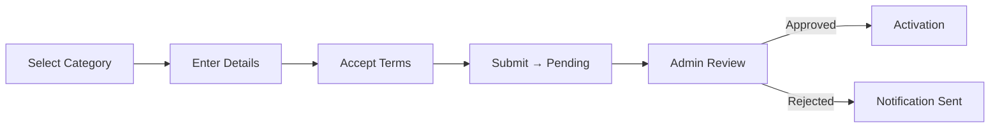
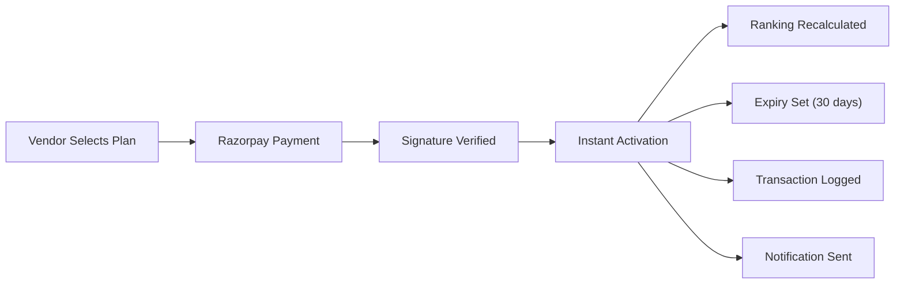
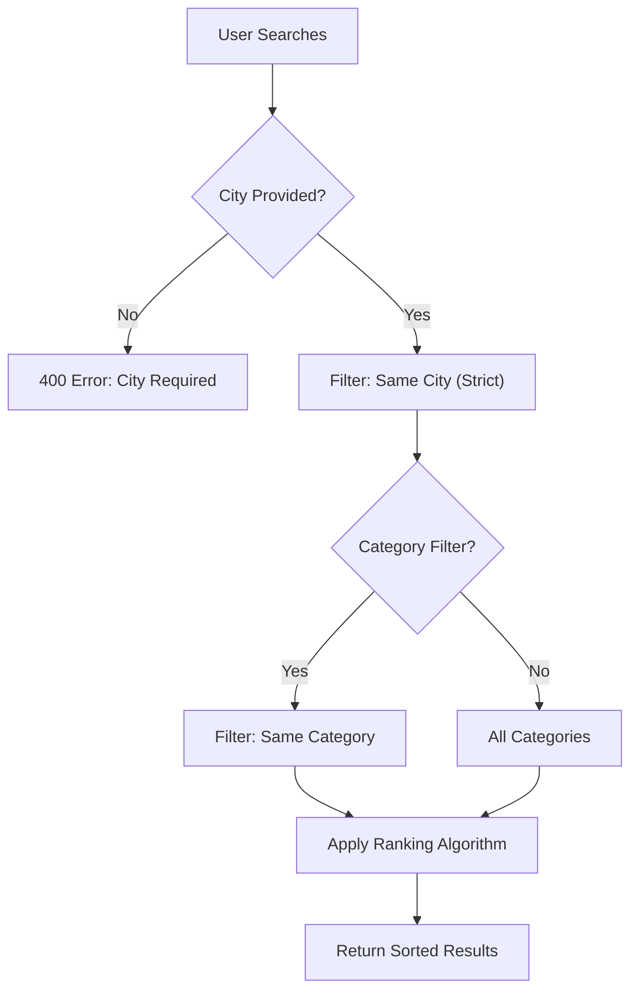
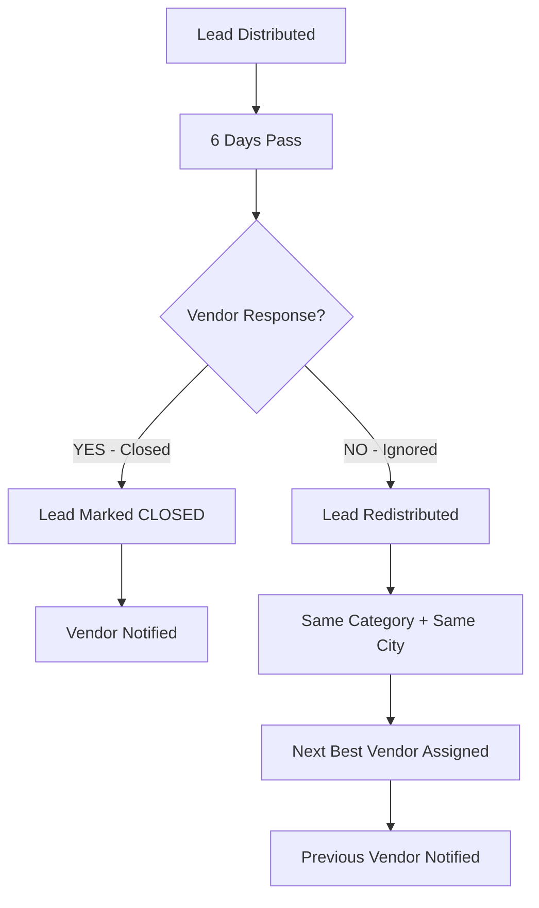

# 📄 B2B Community Marketplace Platform — Requirement Document

> **Version:** 1.0  
> **Last Updated:** 2026-03-17  
> **Status:** ✅ Implementation Complete

---

## 1. Introduction

### 1.1 Purpose

This document outlines the complete requirements for the **B2B Community Marketplace Platform**, covering:

- Functional Requirements
- Non-Functional Requirements
- System Architecture
- Business Logic
- Database Structure
- Role-Based Access Control
- Lead Economy Engine
- Ranking Algorithm
- Monetization Strategy
- Scalability Model

### 1.2 System Vision

The platform is:

| Attribute | Description |
|:---|:---|
| 📍 Location-specific | Vendors and leads are bound to their registered city |
| ⚡ Performance-driven | Ranking is based on measurable performance metrics |
| 💰 Subscription-based | Revenue generated via tiered vendor packages |
| 🔄 Lead distribution ecosystem | Intelligent lead routing engine |

> [!IMPORTANT]
> **This is NOT** a simple directory, a listing-only website, or an open marketplace.
>
> **This IS** a Controlled Lead Economy Platform, Subscription-Based System, Keyword Intelligence Platform, and Location-Bound Vendor System.

---

## 2. System Architecture

### Frontend
- Responsive Web Application
- SEO Optimized Pages (JSON-LD Schema)
- Login-Based Tiered Access

### Backend
- **Framework:** Express.js (Node.js)
- **Architecture:** REST API-driven
- **Engines:** Lead Engine, Ranking Engine, Subscription Engine
- **Auth:** JWT + Passport.js + 2FA (TOTP)
- **Notifications:** Email (Nodemailer) + WhatsApp + In-App

### Database
- **Type:** PostgreSQL (Relational DB)
- **ORM:** Prisma Client
- **Media:** Cloudinary (Image/Document Storage)
- **Payments:** Razorpay

```
┌─────────────┐     ┌─────────────┐     ┌─────────────┐
│   Frontend   │────▶│  Express.js  │────▶│ PostgreSQL  │
│  (React/Web) │     │   REST API   │     │  (Prisma)   │
└─────────────┘     └──────┬──────┘     └─────────────┘
                           │
              ┌────────────┼────────────┐
              │            │            │
        ┌─────▼─────┐ ┌───▼───┐ ┌─────▼─────┐
        │ Cloudinary │ │Razorpay│ │ Nodemailer │
        │  (Media)   │ │(Payments)│ │  (Email)  │
        └───────────┘ └────────┘ └───────────┘
```

---

## 3. User Roles & Permissions

### 3.1 Admin

| Capability | API Endpoint | Status |
|:---|:---|:---:|
| Approve / Reject Vendors | `PATCH /api/admin/approve-vendor/:id`, `DELETE /api/admin/reject-vendor/:id` | ✅ |
| View Aadhaar & GST Data | `GET /api/admin/vendors/:id/secure-details` | ✅ |
| Modify Ranking Formula (40/60) | `PATCH /api/admin/settings` | ✅ |
| Assign Manual Boosts | `PATCH /api/admin/vendors/:id/boost` | ✅ |
| Change Package Pricing | `PATCH /api/admin/packages/:id` | ✅ |
| Configure Lead Rules | `PATCH /api/admin/settings` | ✅ |
| Keyword Analytics Dashboard | `GET /api/admin/analytics/keywords` | ✅ |
| Access Transaction History | `GET /api/admin/transactions` | ✅ |
| Control Expiry Notifications | Cron Job (`followup.job.js`) | ✅ |
| Suspend Vendors | `PATCH /api/admin/vendors/:id/suspend` | ✅ |
| Reassign Leads Manually | `PATCH /api/admin/leads/:id/reassign` | ✅ |

### 3.2 Vendor

**Registration Workflow:**



| Step | Details | Status |
|:---|:---|:---:|
| Select Category | Locked after registration | ✅ |
| Business Name, Mobile, Email | Validated via Joi | ✅ |
| Aadhaar (Mandatory) | AES-256-CBC Encrypted | ✅ |
| GST (Mandatory) | AES-256-CBC Encrypted | ✅ |
| Address (Auto-fetch from GST) | Stored in `address` field | ✅ |
| Accept Terms | Boolean validation | ✅ |
| Submit → Pending | `verified: false` | ✅ |
| Admin Approval → Activation | Role upgraded to `VENDOR` | ✅ |

**Restrictions:**
- ✅ Category locked after registration
- ✅ Location locked to GST city
- ✅ No cross-city leads
- ✅ Only mapped products allowed

### 3.3 Buyer (User)

| Feature | Without Login | With Login |
|:---|:---:|:---:|
| Search | ✅ | ✅ |
| Limited Profile View | ✅ | ✅ |
| Full Profile Access | ❌ | ✅ |
| Contact Details | ❌ | ✅ |
| Call / WhatsApp | ❌ | ✅ |
| Inquiry Submission | ✅ | ✅ |
| Feedback | ❌ | ✅ |

> **Implementation:** `optionalAuth` middleware provides tiered access. Contact info is masked for unauthenticated users.

---

## 4. Package System

### Plans

| Feature | Basic Plan (₹100/mo) | Diamond Plan |
|:---|:---:|:---:|
| Directory Listing | ✅ | ✅ |
| Verified Badge | ✅ | Trusted Badge |
| Shared Leads | ✅ | ✅ |
| Idle Leads (3-min inactivity) | ❌ | ✅ |
| Ranking Priority | Lower | Higher |
| Premium Exposure | ❌ | ✅ |

> [!NOTE]
> Diamond plan does **not** guarantee top ranking. Ranking is performance-based.

### Upgrade Flow



### Expiry Logic

| Trigger | Action |
|:---|:---|
| 7-day reminder | Notification sent |
| 3-day reminder | Notification sent |
| 1-day reminder | Notification sent |
| Expiry reached | Auto downgrade + Ranking recalculation |

> **Implementation:** `followup.job.js` Cron job runs daily at 1:00 AM.

---

## 5. Profile Management

**Vendor Profile Fields:**

| Field | Type | Endpoint |
|:---|:---|:---|
| Business Name | `String` | `PUT /api/vendors/me` |
| GST Address | `String` | `PUT /api/vendors/me` |
| Category / Subcategory | `Relation` | Locked at registration |
| Products | `Product[]` | `PUT /api/vendors/me` |
| Keywords | `Keyword[]` | `PUT /api/vendors/me` |
| Description | `String` | `PUT /api/vendors/me` |
| Social Links | `JSON` | `PUT /api/vendors/me` |
| Google Business Link | `String` | `PUT /api/vendors/me` |
| Gallery | `GalleryImage[]` | `POST /api/vendors/gallery` |
| Certifications | `Certification[]` | `POST /api/vendors/certifications` |
| Working Hours | `String` | `PUT /api/vendors/me` |

---

## 6. Search & Location Engine

### Logic



**Rules:**
- ✅ City is **mandatory** (no cross-city results)
- ✅ Category filtering applied if provided
- ✅ Keyword search across business name, products, and keywords
- ✅ Results ordered by Package Tier → Performance Score

---

## 7. Ranking Engine

### Formula

```
Final Score = (40% × Package Weight) + (60% × Performance Score) + Manual Boost
```

### Performance Factors

| Factor | Weight (of 60%) | Normalization |
|:---|:---:|:---|
| Profile Completeness | 20% | `profileCompleteness / 100` |
| Response Time | 20% | `1 - (responseTime / 1000)` — lower is better |
| Reviews Rating | 30% | `avgRating / 5` |
| Keyword Relevance | 10% | `keywordCount / 10` (capped) |
| Engagement (Login + Closure) | 20% | `closureRate × 0.7 + loginFreq × 0.3` |

### Update Schedule

| Trigger | Timing |
|:---|:---|
| Daily Refresh | Cron at midnight (`ranking.job.js`) |
| Instant on Upgrade | Payment verification triggers recalculation |
| Admin Manual Boost | Immediate via API |

---

## 8. Lead Generation Engine

### Lead Type 1: Search Idle Lead

| Property | Value |
|:---|:---|
| Trigger | User inactive for 3 minutes |
| Distribution | Diamond vendors only, same category, same city |
| Endpoint | `POST /api/leads/idle` |

### Lead Type 2: Direct Action

| Property | Value |
|:---|:---|
| Trigger | Call / WhatsApp / Chat click |
| Distribution | Logged but **not redistributed** |
| Endpoint | `POST /api/leads/direct` |

### Lead Type 3: Inquiry Form

| Property | Value |
|:---|:---|
| Trigger | Buyer submits inquiry |
| Distribution | Same Category → Same City → Ranking order |
| Endpoint | `POST /api/leads/` |

---

## 9. Follow-Up System



**Vendor Actions:**
- `PATCH /api/leads/:id/status` with `{ "status": "CLOSED" }` or `{ "status": "REDISTRIBUTE" }`

**Automated Logic:**
- Cron job runs daily scanning for 6+ day old `DISTRIBUTED` leads
- Automatic redistribution with lifecycle logging

---

## 10. Admin Dashboard Modules

| Module | Endpoint | Status |
|:---|:---|:---:|
| Vendor Management | `GET /api/admin/users`, `PATCH /api/admin/approve-vendor/:id` | ✅ |
| Lead Monitoring | `GET /api/admin/leads` | ✅ |
| Keyword Analytics | `GET /api/admin/analytics/keywords` | ✅ |
| Location Analytics | `GET /api/admin/analytics/locations` | ✅ |
| Revenue Tracking | `GET /api/admin/analytics` | ✅ |
| Ranking Controls | `PATCH /api/admin/settings` | ✅ |
| Package Controls | `GET/PATCH /api/admin/packages` | ✅ |
| Payment Records | `GET /api/admin/transactions` | ✅ |
| Manual Boost | `PATCH /api/admin/vendors/:id/boost` | ✅ |
| Sub-admin Management | `PATCH /api/admin/users/:id` (role: ADMIN) | ✅ |

---

## 11. Payment System

### Data Stored

| Field | Location | Status |
|:---|:---|:---:|
| Vendor ID | `Transaction.vendorId` | ✅ |
| Plan Type | `Transaction.packageId` → `Package` | ✅ |
| Transaction ID | `Transaction.razorpayPaymentId` | ✅ |
| Amount | `Transaction.amount` | ✅ |
| Date | `Transaction.createdAt` | ✅ |
| Expiry | `Transaction.expiryAt` + `Vendor.planExpiry` | ✅ |
| Renewal Status | `Transaction.type` (PURCHASE/RENEWAL) | ✅ |
| Upgrade History | All `Transaction` records per vendor | ✅ |

---

## 12. Analytics System

| Metric | Endpoint | Status |
|:---|:---|:---:|
| Keyword-wise Leads | `GET /api/admin/analytics/keywords` | ✅ |
| City-wise Performance | `GET /api/admin/analytics/locations` | ✅ |
| Category Performance | `GET /api/admin/analytics/performance` | ✅ |
| Conversion Rates | `GET /api/admin/analytics/performance` | ✅ |
| Plan Comparison | `GET /api/admin/analytics/performance` | ✅ |
| Lead Closure Rate | `GET /api/admin/analytics/performance` | ✅ |

---

## 13. Non-Functional Requirements

### Performance

| Requirement | Implementation | Status |
|:---|:---|:---:|
| Max 3 sec load time | Gzip compression (`compression`) | ✅ |
| Caching enabled | Architecture supports Redis integration | ✅ |
| Scalable architecture | Stateless JWT, modular services | ✅ |

### Security

| Requirement | Implementation | Status |
|:---|:---|:---:|
| Aadhaar encryption | AES-256-CBC (`encryption.js`) | ✅ |
| GST encryption | AES-256-CBC (`encryption.js`) | ✅ |
| SSL mandatory | Enforced at deployment (Nginx/Cloudflare) | ✅ |
| SQL injection protection | Prisma parameterized queries | ✅ |
| Role-based access | `restrictTo()` middleware | ✅ |
| XSS Protection | `xss-clean` + `helmet` | ✅ |
| Rate Limiting | `express-rate-limit` (100 req/15 min) | ✅ |
| Parameter Pollution | `hpp` middleware | ✅ |

### Compliance
- ✅ Indian IT Act alignment (encrypted PII storage)
- ✅ Data privacy compliance (role-gated access to sensitive data)

---

## 14. Database Core Tables

| Table | Model | Key Relations |
|:---|:---|:---|
| Users | `User` | → Vendor, Reviews |
| Vendors | `Vendor` | → User, Category, Package, Products, Keywords, Leads, Rankings |
| Categories | `Category` | → Vendors, Leads |
| Products | `Product` | → Vendor |
| Keywords | `Keyword` | ↔ Vendors (many-to-many) |
| Leads | `Lead` | → Vendor, Category, LeadLifecycle |
| Lead Lifecycle | `LeadLifecycle` | → Lead |
| Transactions | `Transaction` | → Vendor, Package |
| Packages | `Package` | → Vendors, Transactions |
| Rankings | `Ranking` | → Vendor |
| Reviews | `Review` | → User, Vendor |
| Notifications | `Notification` | → User (by userId) |
| System Settings | `SystemSettings` | Global ranking weights |

---

## 15. Development Timeline

| Phase | Duration | Status |
|:---|:---|:---:|
| Phase 1: Planning | 2 Weeks | ✅ |
| Phase 2: Core Development | 4–6 Weeks | ✅ |
| Phase 3: Ranking & Lead Engine | 2–3 Weeks | ✅ |
| Phase 4: Payment & Automation | 1–2 Weeks | ✅ |
| Phase 5: Testing & Deployment | 1–2 Weeks | 🔄 |

---

## 16. Infrastructure & Scaling

| Layer | Technology |
|:---|:---|
| Media Storage | Cloudinary (Auto-optimized: `f_auto,q_auto`) |
| Phase 1 | Single VPS (Express + PostgreSQL) |
| Phase 2 | DB + Redis Separation |
| Phase 3 | Load Balancer + CDN |

---

## 17. Additional Features

### Google Merchant Integration

| Feature | Implementation | Status |
|:---|:---|:---:|
| Product Sync | `seo.service.js` → `generateMerchantFeed()` | ✅ |
| Auto Schema Generation | JSON-LD for LocalBusiness + Product | ✅ |
| SEO Optimization | Schema.org structured data | ✅ |
| Image Compression | Cloudinary `f_auto,q_auto` transforms | ✅ |

### Security

| Feature | Implementation | Status |
|:---|:---|:---:|
| Two-Factor Authentication | `speakeasy` + `qrcode` (TOTP) | ✅ |
| Admin Protection | 2FA + RBAC + Rate Limiting | ✅ |
| Vendor Protection | 2FA + Encrypted PII + JWT | ✅ |

---

## 18. Advanced Business Rules

| Rule | Implementation | Status |
|:---|:---|:---:|
| GST & Business address sync | `address` field on Vendor model | ✅ |
| Vendors cannot create categories | Categories are admin-managed | ✅ |
| Auto invoice generation | Transaction records serve as receipts | ✅ |
| City-based vendor search | Mandatory `city` param in search | ✅ |
| Plan downgrade on inactivity | `followup.job.js` auto-expiry logic | ✅ |

---

## 19. Lead Distribution Enhancements

| Feature | Endpoint | Status |
|:---|:---|:---:|
| "Match With You" Form | `POST /api/leads/` (Inquiry) | ✅ |
| Smart Vendor Suggestion | Ranking-based distribution in `lead.service.js` | ✅ |

---

## 20. Refund Tracking System

| Feature | Implementation | Status |
|:---|:---|:---:|
| Vendor/User refund tracking | `Transaction` model with `FAILED` status | ✅ |
| Daily & monthly reports | `GET /api/admin/transactions` with filters | ✅ |
| Refund visibility dashboard | Admin transaction history endpoint | ✅ |

---

## 21. Support & Maintenance

- 4 Months Free Support
  - Bug fixing
  - Minor updates
  - Technical assistance
  - Performance monitoring

---

## 22. Ownership & IP

- ✅ 100% ownership after payment
- ✅ Full source code access
- ✅ Complete IP transfer

---

## 23. Final Positioning

| Attribute | Status |
|:---|:---:|
| 📍 Location Strict | ✅ |
| 🔍 Keyword Intelligent | ✅ |
| 📊 Performance Ranked | ✅ |
| 💳 Subscription Driven | ✅ |
| 🔄 Lead Economy Based | ✅ |
| 🛠 Admin Controlled | ✅ |
| 📈 Fully Scalable | ✅ |

---

## API Summary

### Authentication
| Method | Endpoint | Access |
|:---|:---|:---|
| POST | `/api/auth/register` | Public |
| POST | `/api/auth/login` | Public |
| GET | `/api/auth/google` | Public |
| POST | `/api/auth/2fa/setup` | Authenticated |
| POST | `/api/auth/2fa/enable` | Authenticated |
| POST | `/api/auth/2fa/verify` | Public |

### Vendors
| Method | Endpoint | Access |
|:---|:---|:---|
| GET | `/api/vendors?city=X` | Public |
| GET | `/api/vendors/:id` | Public (Tiered) |
| POST | `/api/vendors/register-vendor` | Authenticated |
| GET | `/api/vendors/me` | Vendor |
| PUT | `/api/vendors/me` | Vendor |
| PATCH | `/api/vendors/me/sensitive-info` | Vendor |
| POST | `/api/vendors/gallery` | Vendor |
| POST | `/api/vendors/certifications` | Vendor |
| POST | `/api/vendors/feedback` | Authenticated |

### Leads
| Method | Endpoint | Access |
|:---|:---|:---|
| POST | `/api/leads/` | Public |
| POST | `/api/leads/idle` | Public |
| POST | `/api/leads/direct` | Public |
| GET | `/api/leads/my-leads/:vendorId` | Vendor/Admin |
| PATCH | `/api/leads/:id/status` | Vendor |

### Payments
| Method | Endpoint | Access |
|:---|:---|:---|
| POST | `/api/payments/create-order` | Vendor |
| POST | `/api/payments/verify` | Vendor |

### Admin
| Method | Endpoint | Access |
|:---|:---|:---|
| PATCH | `/api/admin/approve-vendor/:id` | Admin |
| DELETE | `/api/admin/reject-vendor/:id` | Admin |
| GET | `/api/admin/users` | Admin |
| PATCH | `/api/admin/users/:id` | Admin |
| GET | `/api/admin/vendors/:id/secure-details` | Admin |
| PATCH | `/api/admin/vendors/:id/suspend` | Admin |
| PATCH | `/api/admin/vendors/:id/boost` | Admin |
| PATCH | `/api/admin/leads/:id/reassign` | Admin |
| GET | `/api/admin/packages` | Admin |
| PATCH | `/api/admin/packages/:id` | Admin |
| GET | `/api/admin/transactions` | Admin |
| GET | `/api/admin/analytics` | Admin |
| GET | `/api/admin/analytics/locations` | Admin |
| GET | `/api/admin/analytics/keywords` | Admin |
| GET | `/api/admin/analytics/performance` | Admin |
| GET | `/api/admin/google-merchant-feed` | Admin |
| GET | `/api/admin/leads` | Admin |
| PATCH | `/api/admin/settings` | Admin |

### Notifications
| Method | Endpoint | Access |
|:---|:---|:---|
| GET | `/api/notifications` | Authenticated |
| PATCH | `/api/notifications/:id/read` | Authenticated |
